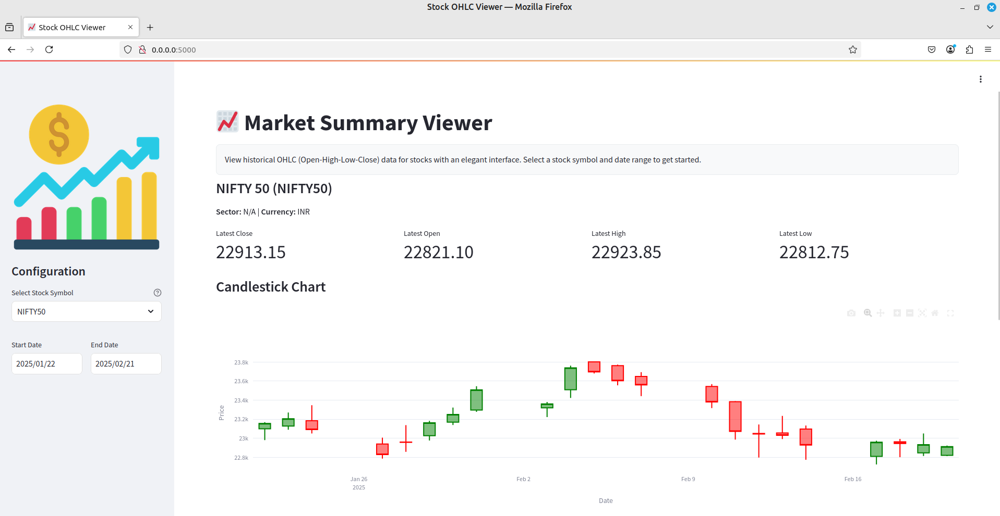
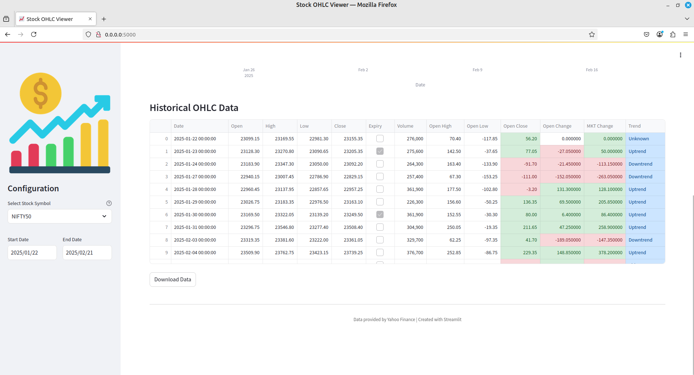

# Market-Summary

This repository is intended to display the market summary on a daily basis. The data is fetched from the Yahoo Finance API and displayed in a tabular format OHLC (Open-High-Low-Close-Trend). The data is fetched using the `yfinance` library in Python.

## Running Locally 🖥️

1. Clone the repo or your fork.
1. Create a virtual environment
    ```sh
    python -m venv venv
    ```
1. Activate the virtual environment
    ```sh
    # Windows 
    venv/Scripts/activate
    
    # Linux/macOS
    source venv/bin/activate
    ```
1. Install required dependencies
    ```sh
    pip install -r requirements.txt
    ```
1. Run the App 
    ```sh
    streamlit run main.py --server.address 0.0.0.0
    ```


